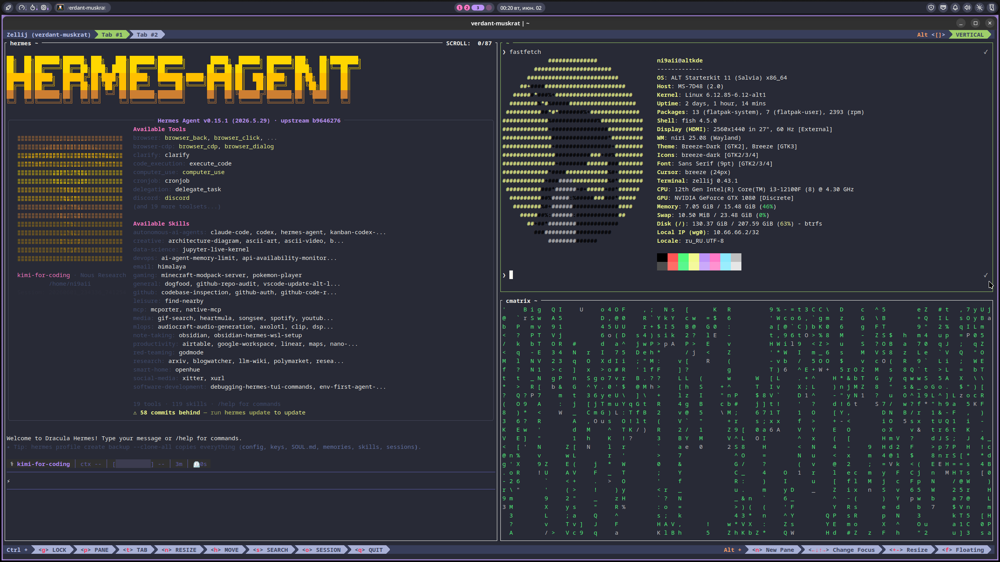

# niri dotfiles

Personal Niri WM + Noctalia configuration dotfiles.

## Structure

```
├── niri/
│   └── config.kdl       # Niri WM configuration
├── assets/
│   └── niri-setup.png   # Setup screenshot
├── niri-keyboard-shortcuts.md  # Full hotkeys reference
├── install.sh           # Installation script
└── README.md            # This file
```

## Installation

```bash
git clone https://github.com/ni9aii/niri-dotfiles ~/dotfiles
cd ~/dotfiles
./install.sh
```

Manual install:
```bash
mkdir -p ~/.config/niri
ln -sf ~/dotfiles/niri/config.kdl ~/.config/niri/config.kdl
```

Reload config: `niri msg action load-config-file`

## Core Hotkeys
| Shortcut | Action |
|----------|--------|
| Mod+T | Alacritty terminal |
| Mod+D | Fuzzel launcher |
| Mod+Q | Close window |
| Mod+O | Overview |
| Mod+Shift+E | Exit niri |

## Noctalia Integration

This config is designed for [Noctalia](https://github.com/noctalia-dev/noctalia) panel — a modern Wayland panel with Niri support.

**Autostart apps:**
- `noctalia-shell` — Noctalia panel
- `kwalletd6` — KDE wallet daemon

## Screenshot



*Workspace example with Noctalia panel. *

## Requirements

- Niri Wayland compositor (v25+)
- Noctalia panel (or compatible alternative)
- Fuzzel (Wayland launcher)
- Alacritty (or preferred terminal)

## Related

- [Niri Keyboard Shortcuts](niri-keyboard-shortcuts.md) — complete reference

---
*Last updated: 2026-06-26*
